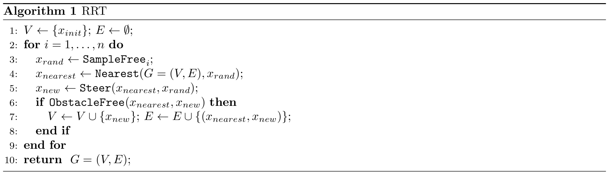

# F1Tenth Motion Planning Algorithm: RRT

> This exercise is based on [CMU 16663 - F1Tenth Course :: Lab 6](https://github.com/f1tenth-cmu/f1tenth_lab6).

# I. Learning Goals

- Motion planning basic concepts
    - **Configuration space vs Workspace**: you should understand the difference between configuration space and workspace, and the advantages and disadvantages of planning in each of them.
    - **Free space vs Obstacle space**: you should understand the difference between free space and obstacle space.
    - **Occupancy grids and Costmaps**: you should understand what occupancy grids and costmaps are, how to use them, and how to create them.
- Motion planning algorithms
    - **Sampling based algorithms**: RRT (Rapidly Exploding Tree) and its variants.

# II. Overview
After finishing this lab, and successfully implementing RRT, your car should be able to do something like [this](https://www.youtube.com/watch?v=llHCRqwIllM). 

Before you start this lab, you should read the paper [Sampling-based Algorithms for Optimal Motion Planning by Karaman, et al.](https://arxiv.org/pdf/1105.1186.pdf) Pay close attention to Sections 3.1, 3.2, and 3.3. For the RRT algorithm, refer to Algorithm 3, as shown below.

### RRT Pseudocode

This is the pseudocode of the vanilla RRT. You can find all the details of the functions used by RRT in the paper. For [RRT*](/algorithms/f1tenth_rrtStar.md), or another version of RRT, read the RRT* section of the provided paper and Algorithm 6. 

### F1Tenth RRT vs Generic RRT
In general, RRT is often used as a global planner where the tree is kept throughout the time steps. Whenever there is a new obstacle, and the occupancy grid changes, the tree will change accordingly. In our case, RRT is used as a local planner for obstacle avoidance. This is due to the fact that we don't have a well-defined starting point and goal point when we're racing on a track and we want to run continuous laps. In our implementation, we are only keeping a tree for the current time step in an area around the car. You could try to keep one tree that populates the map throughout the time steps, but speed is going to be an issue if you don't optimize how you're finding nodes, and traversing the tree.

