# F1Tenth Vehicle States & Dynamics

F1Tenth is used as our "*robot*" throughout this BootCamp, so it's fitting to introduce its states, kinematics, and dynamics here. 

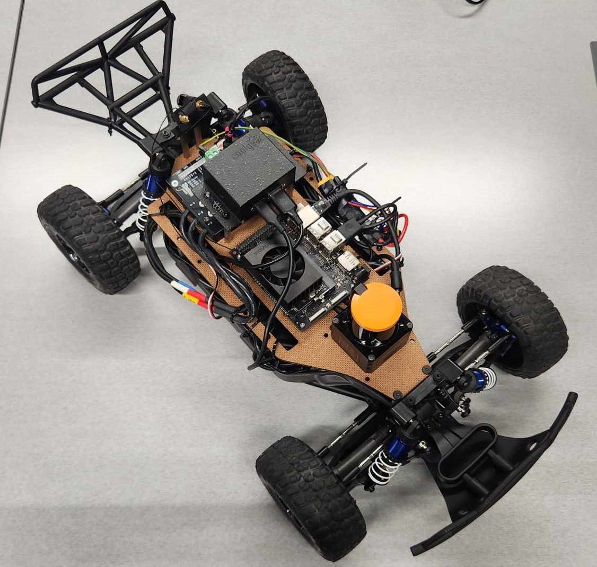

(As shown above, F1Tenth vehicles are open-source, 1∕10-scale autonomous racecars that replicate the sensing, computing, and control stack of full-size self-driving cars.)
 
 

> Note that the majority of the content in this section is from Dr. Johannes Betz's lecture on [F1Tenth L06 - Vehicle States, Vehicle Dynamics, and Map Representations](https://www.youtube.com/watch?v=8zr5NUS05cM&list=PL7rtKJAz_mPdFDJtufKmqfWRNu55s_LMc&index=8) on YouTube.

## 1. F1Tenth Vehicle States

Vehicle states, including position, velocity, and orientation, are fundamental components in dynamic modeling. Accurate measurement and representation of these states enable better predictions and refined control, ensuring that the model closely mirrors real-world driving scenarios.

Here, we introduce the essential states used when modeling the F1Tenth vehicle dynamics.

### **Position**

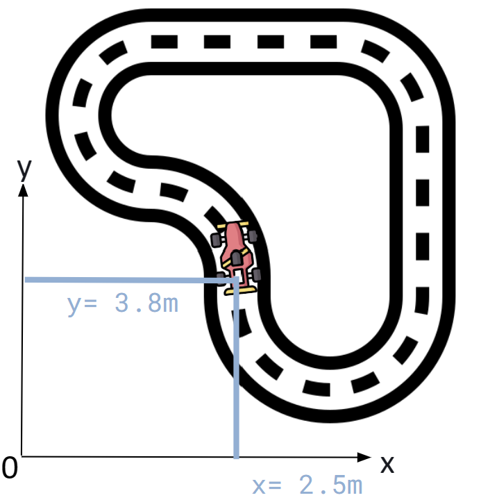

*Position* defines the translation of the vehicle in some global or local frame. It's respective to the vehicle's center of gravity (CoG) or a pre-defined based frame. Normally, the $x$- and $y$-positions have **meters** as their units.

### **Heading**

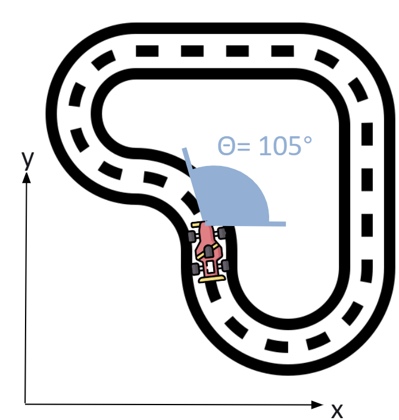

*Heading* defines the rotation of the vehicle in some local and global frame. This is usually with respect to the $x$-axis of the local frame. 

When represented as a single angle reading, heading can be displayed in ranges from:
- $[-\pi, \pi] = [-180^\circ, 180^\circ]$
- $[0, 2\pi] = [0^\circ, 360^\circ]$

The heading angle can be represented as RPY, Rotation Matrix, Quaternion, etc.

### **Linear Velocity and Acceleration**

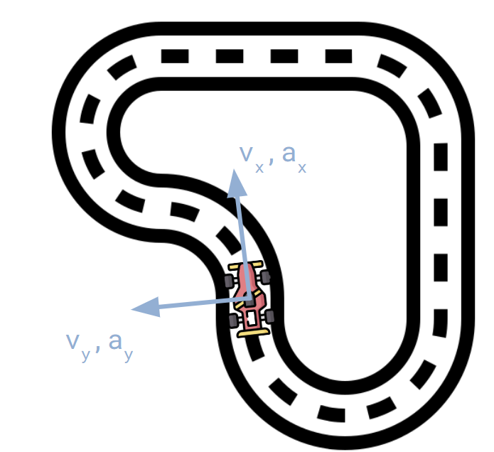

*Linear velocity and acceleration* are measured in the $x$- and $y$- (and $z$-) axis in the coordinate system of the vehicle. 
For vehicles, there are **longitudinal** ($x$-axis) and **lateral** ($y$-axis) velocities and accelerations. Here, the right-hand-rule is used.

Velocity is measured in meters per second [$m/s$] and acceleration in meters per second squared [$m/s^2$].

These can be measured with GPS, IMU, wheel speed sensors, pitot sensors, etc. 

### **Angular Velocity and Acceleration**

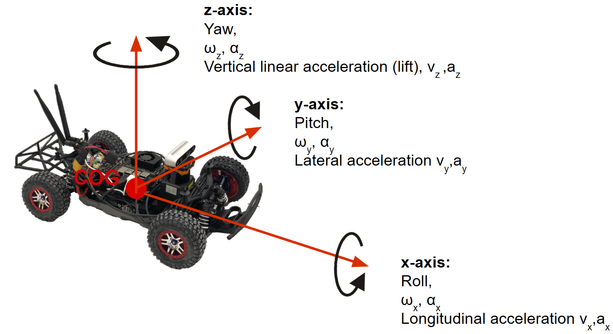

### **Steering Angle**

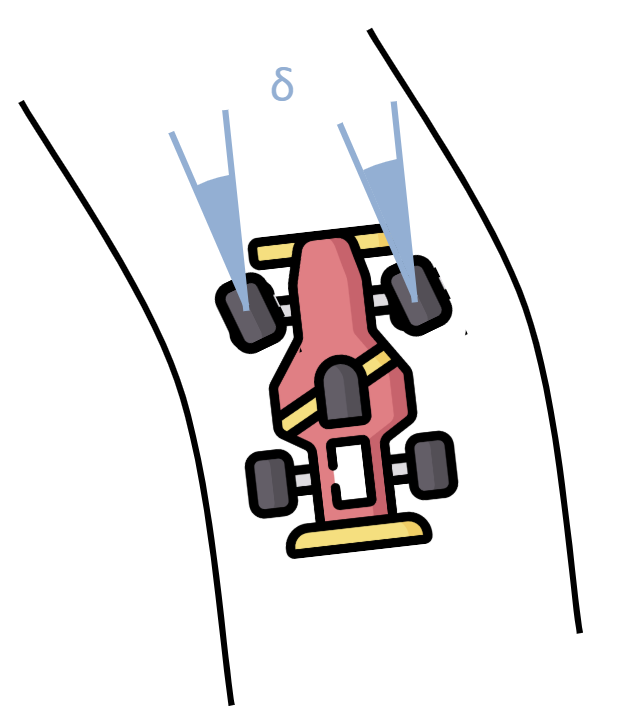

*Steering angle* $\delta$ is the angle formed by the direction the front wheels are pointing at and the vehicle's $x$-axis. Steering angle is the same for both front wheels and are in radians or degrees.

### **Slip Angles**

**Sideslip**

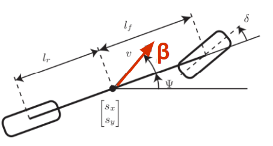

*Sideslip* angle $\beta$ is between the direction of travel and the $x$-axis of the chassis. 

**Slip**

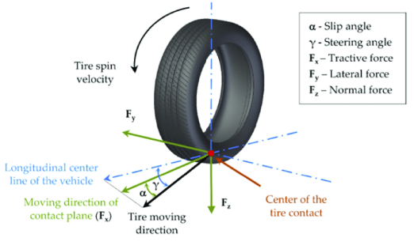

*Slip* angle $\alpha$ is between the direction of travel and the angle the wheel is pointing towards.

**Wheelslip**

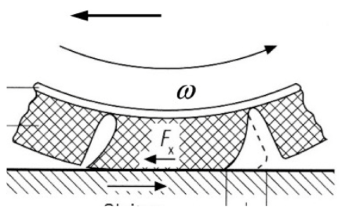

*Wheelslip* ratio is the normalized difference between a wheel's circumferential speed and the vehicle's actual ground speed. This indicates how much the tire is spinning or skidding relative to the road surface.

$$\text{wheelslip ratio } \% = \left( \frac{\Omega \; R_c}{V} - 1\right) \times 100 \%$$

> Essentially, sideslip is the angle when you drift and slip is whenever there's steering. Wheelslip is when you're doing a burnout.

## 2. Vehicle Dynamics Model

As mentioned before, we are only interested in analytical dynamics models in this BootCamp. While there are many different analytical models available for a vehicle (as shown below), for the ease of representation, math, and computation, we will focus on single track model.

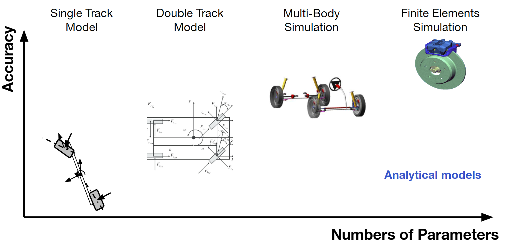

(Note that all of these are analytical models, meaning that you can represent the model with system of equations.)

### Single Track (Bicycle) Model
In single track model, also called the "bicycle model", we make some simplifications:
- wheels of one axle are combined (two front wheels are combined to one, two rear wheels are combined to one),
- center of gravity is at road level,
- no rolling,
- no pitching,
- no wheel load differences between left and right, and
- no vertical dynamics (in the $z$-direction).

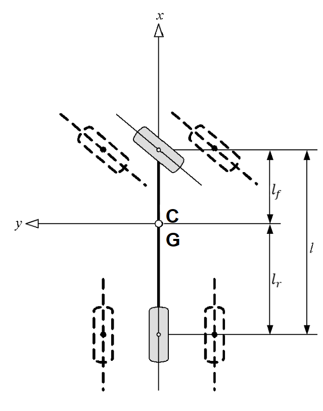

### Kinematic Single Track Model
Here, we make further simplications: **no tire dynamics**, and hence **no lateral forces/accelerations and slip angles**.

At slow velocities, especially when cornering slowly, kinematic model is usually accurate enough for simulation. The Ackermann steering is modeled around an instantaneous pole.

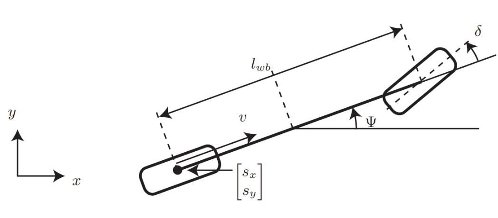

Here, the **states** are as follows:
- $x_{1}=s_{x}$:  Global $x$-position of the vehicle’s rear axle [m] 
- $x_{2}=s_{y}$:  Global $y$-position of the vehicle’s rear axle [m] 
- $x_{3}=\delta$:  Front-wheel steering angle (positive left) [rad] 
- $x_{4}=v$:  Longitudinal speed in the body–$x$ direction [m/s] 
- $x_{5}=\Psi$:  Yaw (heading) angle in the global frame [rad] 

The **control inputs** are as follows:
- $u_{1}=v_{\delta}$:  Steering-angle rate command [rad/s] 
- $u_{2}=a_{\text{long}}$:  Longitudinal acceleration command [$m/s^{2}$] 

The **continuous-time dynamics** is follows, where $l_{wb}$ is the wheel-base.

$$
\begin{aligned}
\dot{x}_1 &= x_4 \cos(x_5) \\
\dot{x}_2 &= x_4 \sin(x_5) \\
\dot{x}_3 &= f_5(x_3,u_1)
\end{aligned}
$$
<!-- 
\\
\dot{x}_4 &= f_{acc}(x_4,u_2) \\
\dot{x}_5 &= \frac{x_4}{l_{wb}} \tan(x_3) 
-->

$$
\begin{aligned}
\dot{x}_{1} &= y \cos(x_5)\\
y &= x
\end{aligned}
$$

- $f_{\text{steer}}$ captures steering actuator dynamics or limits.  
- $f_{\text{acc}}$ captures drivetrain dynamics, drag, or throttle/brake limits.

### Dynamic Single Track Model with Linear Tire Model
On top of the kinematic single track model, we add a linear tire model to derive the dynamic single track model with linear tire model. Here, we can consider the important effects such as understeer or oversteer. Introduction of tire forces mean
- a tire can apply lateral and longitudinal tire forces,
- a tire can apply more forces if there is a higher friction coefficient $\mu$,
- a linear relation between tire force and side slip angle,
- model the tire dynamics with the cornering stiffness $C_\alpha$, or the cornering stiffness coefficient $C_s$.

**Linear Tire Model**

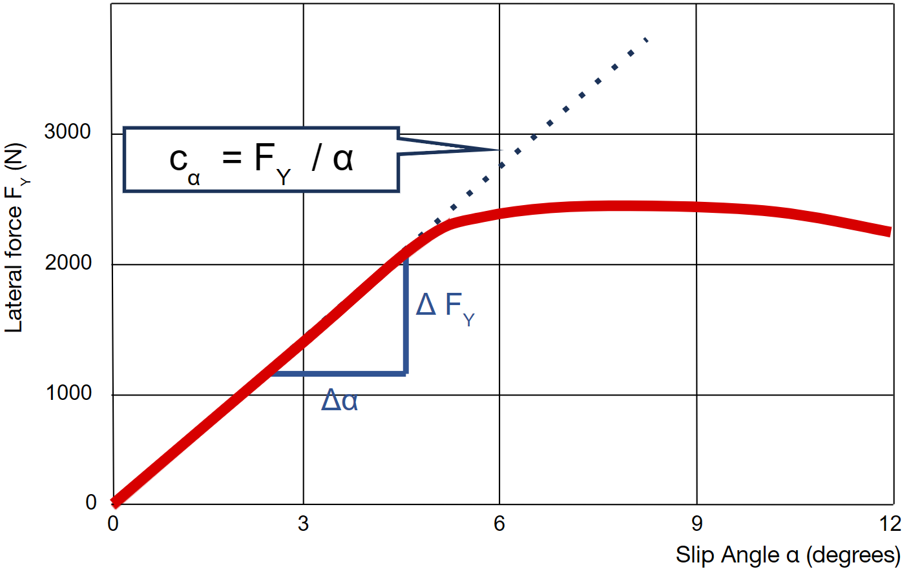

For small slip angles $\alpha$ (typically $\lvert\alpha\rvert\lesssim 4^\circ$) a tire’s lateral force $F_Y$ grows **proportionally** to that angle:

$$
F_Y \;=\; C_\alpha \,\alpha ,
\qquad C_\alpha \;\text{[N/rad]} \;=\; \text{cornering stiffness}.
$$

Hence the entire tire is captured by a *single constant* slope $C_\alpha$; side-force builds like a linear spring.

* **Red curve** – real tire data: force climbs almost linearly, peaks, then flattens and finally drops as the tire saturates.  
* **Blue dotted line** – idealised *linear* extension of the initial slope; this is what the linear model would predict at larger $\alpha$.  
* $\Delta F_Y$ and $\Delta\alpha$ show how the experimental slope near the origin is measured to obtain $C_\alpha = \Delta F_Y / \Delta\alpha$.

The key takeaway is that the linear model is only faithful up to the “knee” of the curve—beyond that it **over-predicts** the available side force.

**Dynamic Model**

Here, the **states** are as follows:
- $x_{1}=s_{x}$:  Global $x$-position of the vehicle’s centre of gravity (CG) [m] 
- $x_{2}=s_{y}$: Global $y$-position of the CG [m] 
- $x_{3}=\delta$: Front-wheel steering angle (positive = left) [rad] 
- $x_{4}=v$: Vehicle speed along the body $x$-axis [m s$^{-1}$] 
- $x_{5}=\Psi$: Yaw (heading) angle in the global frame [rad] 
- $x_{6}=\dot\Psi$: Yaw rate [rad s$^{-1}$] 
- $x_{7}=\beta$: Side-slip angle at the CG [rad] 

The **control inputs** are as follows:
- $u_{1}=v_{\!\delta}$: Steering-angle rate command [rad s$^{-1}$] 
- $u_{2}=a_{\text{long}}$: Longitudinal acceleration command (throttle/brake) [m s$^{-2}$] 

The **parameters** are as follows:
- $l_{f},\,l_{r}$: distance from CG to front / rear axle  
- $h_{cg}$: CoG height above ground  
- $C_{S,f},\,C_{S,r}$: cornering-stiffness **coefficients** (front, rear)  
- $m$: vehicle mass  
- $I_{z}$: yaw moment of inertia  
- $\mu$: tire–road friction coefficient  
- $g$: gravity 

The **continuous-time dynamics** is follows:
$$
\begin{aligned}
\dot{x}_{1} &= x_{4}\,\cos\!\bigl(x_{5}+x_{7}\bigr) \\
\dot{x}_{2} &= x_{4}\,\sin\!\bigl(x_{5}+x_{7}\bigr) \\
\dot{x}_{3} &= f_{\text{steer}}\!\bigl(x_{3},\,u_{1}\bigr) \\
\dot{x}_{4} &= f_{\text{acc}}\!\bigl(x_{4},\,u_{2}\bigr) \\
\dot{x}_{5} &= x_{6} \\
\dot{x}_{6} &= 
\frac{\mu\,m}{I_{z}\,(l_{r}+l_{f})}\!
\Bigl[
      l_{f}C_{S,f}\!\bigl(g\,l_{r}-u_{2}h_{cg}\bigr)\,x_{3}
    + \bigl(l_{r}C_{S,r}\!\bigl(g\,l_{f}+u_{2}h_{cg}\bigr)
    - l_{f}C_{S,f}\!\bigl(g\,l_{r}-u_{2}h_{cg}\bigr)\bigr)x_{7} \\
&\hspace{5.45cm}
    -\bigl(l_{f}^{2}C_{S,f}\!\bigl(g\,l_{r}-u_{2}h_{cg}\bigr)
    + l_{r}^{2}C_{S,r}\!\bigl(g\,l_{f}+u_{2}h_{cg}\bigr)\bigr)
      \frac{x_{6}}{x_{4}}
\Bigr] \\
\dot{x}_{7} &= 
\frac{\mu}{x_{4}\,(l_{r}+l_{f})}\!
\Bigl[
      C_{S,f}\!\bigl(g\,l_{r}-u_{2}h_{cg}\bigr)\,x_{3}
    - \bigl(C_{S,r}\!\bigl(g\,l_{f}+u_{2}h_{cg}\bigr)
      + C_{S,f}\!\bigl(g\,l_{r}-u_{2}h_{cg}\bigr)\bigr)x_{7} \\
&\hspace{5.55cm}
    + \bigl(C_{S,r}\!\bigl(g\,l_{f}+u_{2}h_{cg}\bigr)l_{r}
      - C_{S,f}\!\bigl(g\,l_{r}-u_{2}h_{cg}\bigr)l_{f}\bigr)
      \frac{x_{6}}{x_{4}}
\Bigr] \;-\; x_{6}
\end{aligned}
$$

- $f_{\text{steer}}$ models steering-actuator limits/dynamics (e.g., first-order servo).  
- $f_{\text{acc}}$ models drivetrain and drag effects (e.g., engine lag, braking saturation).  

This set of seven first-order ODEs captures both longitudinal and planar dynamics, including yaw coupling and side-slip, yet retains computational efficiency by using **linear tire forces**.