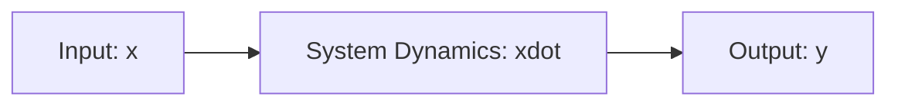

# F1Tenth Vehicle States

Dynamic modeling plays a critical role in understanding and predicting a robot's behavior under various operating conditions. By using mathematical representations, engineers can simulate responses, optimize control strategies, and improve performance safety.

Vehicle states, including position, velocity, and orientation, are fundamental components in dynamic modeling. Accurate measurement and representation of these states enable better predictions and refined control, ensuring that the model closely mirrors real-world driving scenarios.

