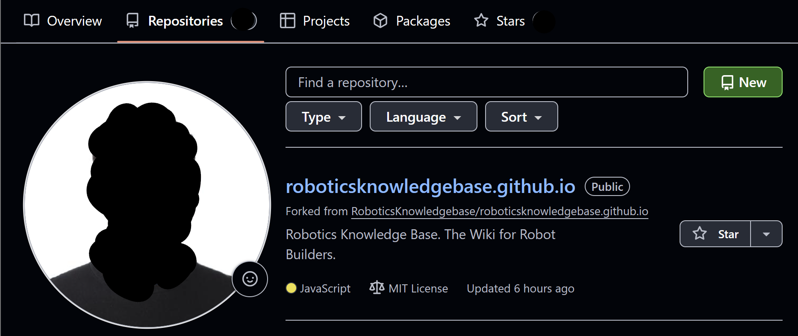
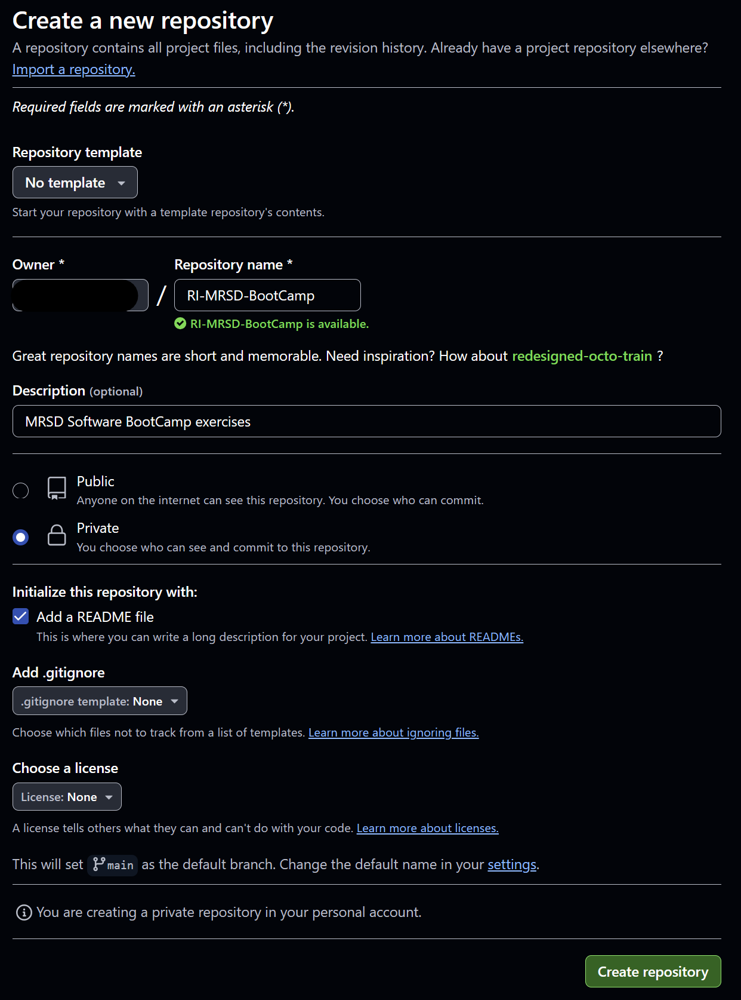
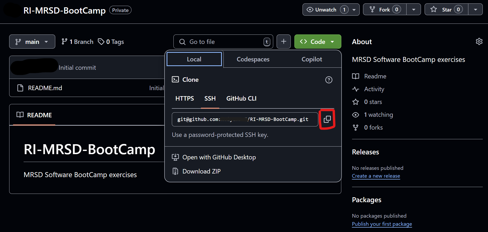

# GitHub

GitHub is a web-based platform that leverages Git, a distributed version control system, to facilitate collaborative software development. It offers tools for version control, issue tracking, continuous integration, and more, making it an essential resource for developers worldwide.

## GitHub Student Developer Pack

The GitHub Student Developer Pack provides students with free access to various developer tools, cloud services, and learning resources. Benefits include:

- **GitHub Pro**: Unlimited private repositories and advanced collaboration features.
- **GitHub Copilot**: An AI-powered coding assistant that helps you write code faster and with fewer errors.
- **Domain Names and Hosting**: Free domain registrations and hosting services to showcase your projects.
- **Cloud Services**: Credits for platforms like Microsoft Azure and DigitalOcean to deploy applications.
- **Learning Platforms**: Access to courses on platforms such as Educative and Frontend Masters.

To apply, visit the [GitHub Education page](https://education.github.com/pack) and follow the instructions to verify your student status.

## Creating Your GitHub Account and Profile

1. **Sign Up**: Go to [GitHub's website](https://github.com) and click "Sign up" to create a new account.
2. **Set Up Your Profile**:
   - **Profile Picture**: Upload a professional or recognizable photo.
   - **Bio**: Write a brief introduction about yourself.
   - **Location**: Add your geographical location.
   - **Website**: Link to your personal website or portfolio if available.

# Using GitHub through Command-Line Interface (CLI)

This section provides hands-on exercises to familiarize you with GitHub's functionalities using the command-line interface (CLI). These exercises will guide you through repository creation, branching, merging, issue management, and collaboration — all from the terminal.

## Prerequisites
- **Git Installation**: Ensure Git is installed on your system. Verify by running:
  ```bash
  ~$ git --version
  ```
   If not installed, download it from the [official Git website](https://git-scm.com/).

- **SSH Key to GitHub account**: When you’re working with GitHub from your local machine, GitHub needs a reliable way to verify it’s really you trying to push or pull code. An SSH key provides a secure, password-less link between your local environment and GitHub, ensuring that only someone who holds the corresponding private key (stored on your computer) can interact with your repositories.
  - First, [generate a new SSH key and adding it to the ssh-agent](https://docs.github.com/en/authentication/connecting-to-github-with-ssh/generating-a-new-ssh-key-and-adding-it-to-the-ssh-agent).
  - Next, [add this new SSH key to your GitHub account](https://docs.github.com/en/authentication/connecting-to-github-with-ssh/adding-a-new-ssh-key-to-your-github-account).


## Exercise 1: Creating Your First GitHub Repository

A repository (repo) is a storage space where your project's files and revision history are kept. You can either create a local repo from your machine and push it to remote repo or create a remote repo and clone it to your machine. 

1. **Create a New Repository**:
   - Go to "Repositories" in your profile.
   - Click the "New" button icon in the upper-right corner.
     
   - Name your repository `RI-MRSD-BootCamp` for consistency throughout the Software Bootcamp.
   - Add a brief description.
   - Choose between public or private visibility. (Private recommended for the BootCamp.)
   - Check "Add a README file".
     
   - Click "Create repository".

   - **Understanding `README.md` and Markdown**:
     - **`README.md`**: A markdown file that provides information about your project, such as its purpose, how to set it up, and usage instructions.
     - **Markdown**: A lightweight markup language with plain text formatting syntax. It allows you to format text using headers, lists, links, and more. For example:
       ```markdown
       # Header 1
       ## Header 2
       - Bullet point
       ```
     - For a comprehensive guide, refer to [GitHub's Mastering Markdown](https://guides.github.com/features/mastering-markdown/).

2. **Clone Repository to Local Machine**:
   - Copy the SSH link to clone your GitHub repository.
   
   - Clone the GitHub repository to your local machine. In your CLI:
      ```bash
      ~$ git clone git@github.com:[Username]/RI-MRSD-BootCamp.git
      ```
   - This will clone your repo to your local machine. Now you can make changes to the local repo using your machine and commit/push your changes so that it's tracked and saved.

3. **Making Your First Commit and Push**:
   - Now, let's make some changes to your local repo and push it to your remote repo.
      ```bash
      ~$ cd RI-MRSD-BootCamp
      ~/RI-MRSD-BootCamp$ touch hello.py
      ~/RI-MRSD-BootCamp$ git add .
      ~/RI-MRSD-BootCamp$ git commit -m "First commit"
      ~/RI-MRSD-BootCamp$ git push
      ```
   - For more information on these commands, refer to [this Medium post](https://medium.com/@itsmepankaj/git-workflow-add-commit-push-pull-69adf44cf812).

## Exercise 2: Branching and Merging

Branches allow you to work on different parts of a project simultaneously without affecting the main codebase. The main branch (often named `main` or `master`) represents the stable version of your code, while you can create other branches for experimentation or feature development.

1. **Create a new branch named `pid`**:
   ```bash
   ~/RI-MRSD-BootCamp$ git checkout -b pid
   ```
   This command creates and switches you to a new branch named `pid`.

2. **Make some changes (e.g., edit `hello.py` or create a new file)**:
   ```bash
   ~/RI-MRSD-BootCamp$ echo "print('PID Controller')" >> hello.py
   ~/RI-MRSD-BootCamp$ git add .
   ~/RI-MRSD-BootCamp$ git commit -m "Add PID-related code"
   ```

3. **Switch back to `main` branch**:
   ```bash
   ~/RI-MRSD-BootCamp$ git checkout main
   ```

4. **Create another new branch named `mpc`**:
   ```bash
   ~/RI-MRSD-BootCamp$ git checkout -b mpc
   ```

5. **Make some changes (e.g., edit `hello.py` or create a new file)**:
   ```bash
   ~/RI-MRSD-BootCamp$ echo "print('MPC Controller')" >> hello.py
   ~/RI-MRSD-BootCamp$ git add .
   ~/RI-MRSD-BootCamp$ git commit -m "Add MPC-related code"
   ```

6. **Switch back to `main` and merge the `pid` branch**:
   ```bash
   ~/RI-MRSD-BootCamp$ git checkout main
   ~/RI-MRSD-BootCamp$ git merge pid
   ```
   - Resolve any merge conflicts if prompted (by editing the conflicting files and committing the merged result).

7. **Merge the `mpc` branch**:
   ```bash
   ~/RI-MRSD-BootCamp$ git merge mpc
   ```
   - Again, resolve any merge conflicts if they occur.

8. **Push your updated `main` branch to GitHub**:
   ```bash
   ~/RI-MRSD-BootCamp$ git push
   ```
   - If you have never pushed the branches before, you might also need:
      ```bash
      git push -u origin pid
      git push -u origin mpc
      ```

By using branches, you can safely develop new features or bug fixes without disrupting the stable `main` code. Once a feature is complete, you merge it back into `main`, ensuring a clean and organized commit history.


## Exercise 3: Creating an Issue

Issues are used to track tasks, enhancements, and bugs. Using issues helps you organize tasks, gather feedback, and track bugs, making it easier for both you and collaborators to stay informed and focused on project goals.

1. **Go to your repository on GitHub**:
   - Open your `RI-MRSD-BootCamp` repository in the browser.
2. **Open the "Issues" tab**:
   - You will see a button labeled "New Issue". Click it to create a new issue.
3. **Fill out the issue details**:
   - **Title**: Provide a short summary (e.g., "Add More Examples to README").
   - **Description**: Describe the task or bug in detail.
   - **Labels** (optional): Categorize issues (e.g., `enhancement`, `bug`, etc.).
   - **Assignees** (optional): Assign the issue to yourself or a collaborator who will address it.
4. **Submit the issue**:
   - Click "Submit new issue". Your issue is now open and can be referenced in commit messages or during code reviews.

## Collaboration on GitHub
GitHub is built for collaboration. Whether you’re working on personal projects or large-scale open-source endeavors, version control and issues help you manage changes while staying transparent about what’s happening in the codebase. 

[Git Pull-Request Workflow Exercise](git_pull_request_exercise.md) complements the information below. It's a good exercise!

1. **Fork and Pull**: If you’re contributing to someone else’s repository, you can fork the repo, make changes on a new branch, and then submit a pull request (PR). The repository owner can review your changes, request modifications, and merge your branch into their codebase.

2. **Pull Requests for Team Collaboration**: In a team setting (or even for your own projects), creating a branch and opening a pull request allows you (and others) to review changes before merging them to the main branch. This prevents breaking changes and fosters discussion around code style and design choices.

3. **Code Reviews**: Collaborators can leave comments, suggestions, or request changes directly on specific lines of code in the pull request. This ensures that every member of the team understands the changes and can contribute to a better overall design.

## Additional Resources

- **[GitHub Docs](https://docs.github.com/en)**: Official GitHub documentation, covering everything from repositories to advanced Git configurations.
- **[Git Cheat Sheet](https://training.github.com/downloads/github-git-cheat-sheet/)**: Quick reference guide for common Git commands.
- **[GitHub Learning Lab](https://lab.github.com/)**: Interactive courses to learn GitHub.
- **[GitHub Guides](https://guides.github.com/)**: In-depth guides on various GitHub topics.
- **[Pro Git Book](https://git-scm.com/book/en/v2)**: Comprehensive book on Git.

[](https://www.youtube.com/watch?v=RGOj5yH7evk)

This video provides a comprehensive overview suitable for beginners.
